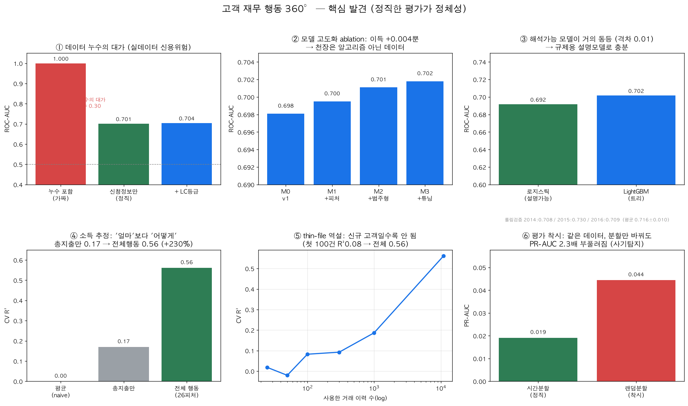
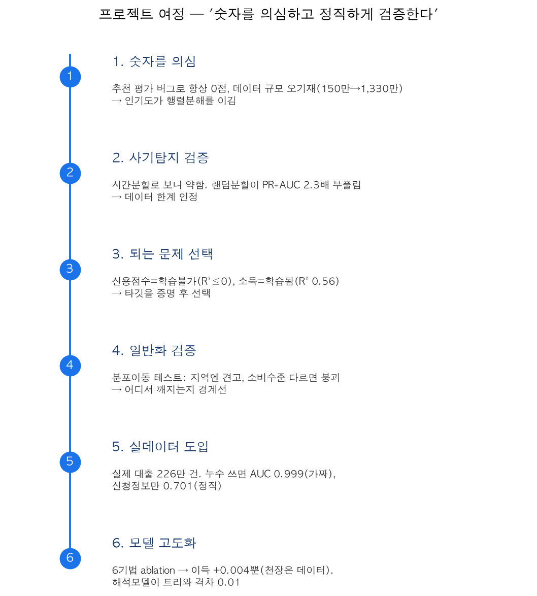

# 한 장 요약 — 금융 신용 스코어링 시스템

> **실제 대출 데이터로 연체를 예측해 *실시간 API로 서빙*하고, 카드 거래로 소득을 추정하며 —
> 매번 데이터가 그 문제를 지탱하는지 먼저 검증하고, 누수·평가 착시를 제거해 정직한 성능만
> 보고한 금융 ML 시스템.** (학습→서빙→설명가능 의사결정)

---

## 여정 — 왜 이렇게 했나

| 단계 | 질문 | 발견 |
|---|---|---|
| 1 | 기존 숫자를 믿을 수 있나? | 추천 평가 **버그로 항상 0점**, 데이터 규모도 오기재(150만→**1,330만**). 고치니 *인기도가 행렬분해를 이김* |
| 2 | 사기탐지는 진짜 되나? | 시간분할로 보니 약함. *랜덤분할이 PR-AUC를 2.3배 부풀림*을 증명 → 데이터 한계 인정 |
| 3 | 이 데이터로 뭐가 되나? | 신용점수=학습불가(R²≤0), **소득=학습됨(R² 0.56)**. 타깃을 *증명 후* 선택 |
| 4 | 진짜 세상에서도 통하나? | 분포이동 테스트: 지역엔 견고, **소비수준 다르면 붕괴**(covariate shift) |
| 5 | 합성이라 못 믿겠다 | **실제 대출 226만 건** 도입. 누수 쓰면 AUC 0.999(가짜), 신청정보만 **0.701(정직)** |
| 6 | 모델을 더 키울 수 있나? | 6개 기법 적용 → 이득 **+0.004뿐**. *천장은 알고리즘 아닌 데이터*. 대신 **해석모델이 트리와 격차 0.01** |

---

## 두 개의 기둥

| | A. 소득 추정 (합성 1,330만 거래) | B. 신용위험 (실데이터 130만 대출) |
|---|---|---|
| 과제 | 거래 행동 → 연소득 추정(대안 소득검증) | 신청정보 → 연체 예측(여신 심사) |
| 성능 | **R² 0.56**, 중앙오차 $7K, 고소득 AUC 0.89 | **AUC 0.701**(정직), 롤링 0.716±0.010 |
| 핵심 발견 | 소득은 '얼마'보다 '어떻게'(다양성·변동성·이동성) | 누수의 대가 0.30, 해석모델로 충분 |
| 한계(정직) | thin-file 고객엔 안 됨, 연령 편향 | 절대 성능은 천장(데이터), 저소득 거절 트레이드오프 |

---

## 핵심 접근과 기여

- **데이터 적정성 판별**: 안 되는 타깃(신용점수)을 검증으로 배제하고 되는 타깃(소득)을 선택
- **데이터 누수 탐지**: 실데이터에서 가짜 AUC 0.999를 찾아 제거 → 정직한 0.701
- **정직한 평가**: 시간분할·롤링검증·신뢰구간·베이스라인 대비·분포이동 스트레스 테스트
- **금융 도메인**: 비용기반 운영점, 세그먼트 공정성, 해석가능 스코어카드·SHAP 사유코드
- **객관적 모델 개발**: ablation으로 각 개선의 기여를 측정(성능 천장 확인)

---

## 정직한 한계

- 합성 데이터 부분은 *절대 수치가 아닌 관계·구조*를 주장(데이터 현실성과 무관하게 참).
- 공개 데이터라 새로움(novelty)은 제한적 — 가치는 *방법론의 엄밀함*에 있다.

---

## 핵심 요약 한 줄

> 카드 거래(합성 1,330만)·실제 대출(130만)로 소득·연체를 예측하고, 데이터 누수·평가 착시를
> 정량적으로 제거해 정직한 성능(소득 R² 0.56 / 연체 AUC 0.70)을 보고. 누수를 포함하면 0.999가
> 나오지만 그것이 *가짜*임을 실증.
